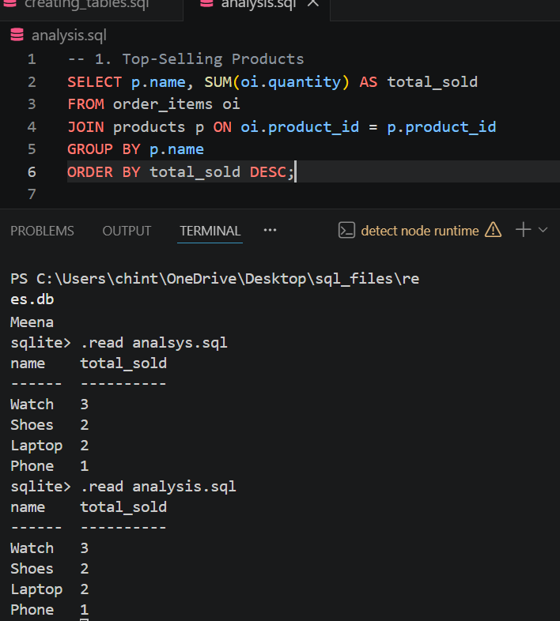
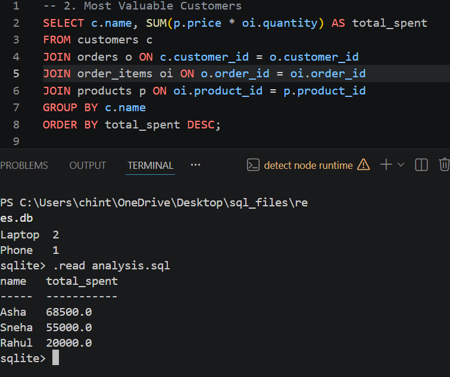
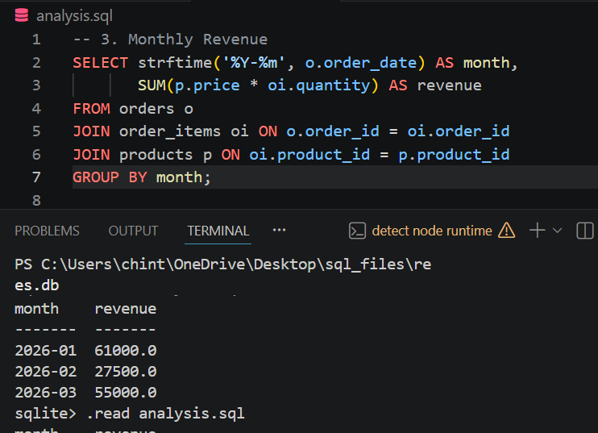
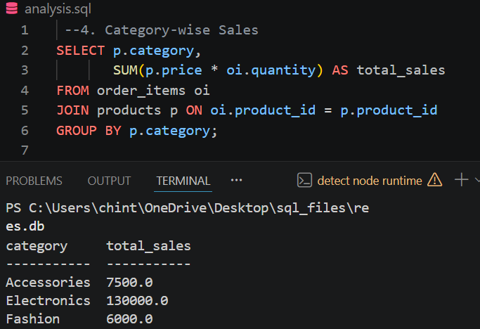
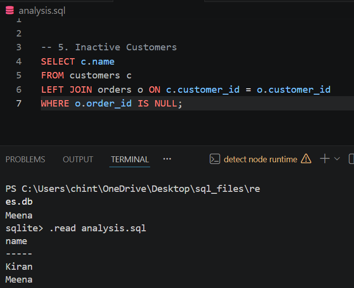

# RETAIL_SALES
 Online Retail Sales Analysis using SQLite

 Project Description

The **Online Retail Sales Analysis** project is designed to demonstrate how structured databases and SQL queries can be used to extract meaningful insights from retail data. This project simulates a simplified e-commerce system where customers purchase products, and each transaction is recorded and analyzed.

A relational database is created using SQLite to store information about customers, products, orders, and order items. The data is organized in a normalized format to ensure efficiency, reduce redundancy, and maintain data integrity through the use of primary and foreign keys.

The main objective of this project is to analyze sales performance and customer behavior using SQL queries. By applying operations such as joins, aggregations, grouping, and filtering, the project generates useful business insights such as identifying top-selling products, calculating monthly revenue, analyzing category-wise sales, and detecting inactive customers.

This project highlights the practical application of SQL in real-world scenarios, particularly in retail analytics. It helps in understanding how raw transactional data can be transformed into actionable information that supports business decision-making.
key Features
* Designed a normalized relational database using SQLite
* Established relationships between tables using foreign keys
* Inserted and managed structured retail data
* Performed advanced SQL queries for data analysis
* Generated insights on sales trends and customer activity

Learning Outcomes

* Understanding of relational database design
* Hands-on experience with SQL (JOIN, GROUP BY, aggregation)
* Ability to analyze and interpret business data
* Knowledge of organizing and querying real-world datasets
conclusion
This project successfully demonstrates how SQL can be used as a powerful tool for data analysis in retail systems. It provides a strong foundation for building data-driven applications and understanding business intelligence concepts.

QUERIES

1.Top-Selling Products

2. Most Valuable Customers

3.Monthly Revenue

4. Category-wise Sales

5. Inactive Customers

